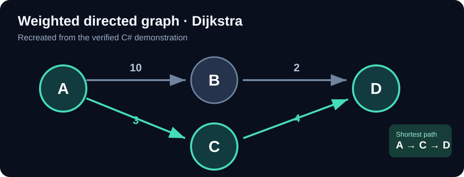

# Graph Algorithms in C# — DFS, BFS and Dijkstra

**C# · .NET 10 · Data Structures & Algorithms · Console Application**

[← Academic portfolio](../ACADEMIC_PORTFOLIO.md)

A C# console program that represents a **weighted directed graph** and demonstrates depth-first traversal, breadth-first traversal, and Dijkstra's shortest-path algorithm.



*This diagram is reconstructed from the supplied C# source. It is not a console screenshot.*

## Graph definition

| Directed edge | Weight |
| --- | ---: |
| A → B | 10 |
| A → C | 3 |
| B → D | 2 |
| C → D | 4 |

`Graph.cs` stores adjacent vertices and edge weights in `Dictionary<string, Dictionary<string, int>>`. `Program.cs` builds the example and invokes three algorithms.

## Verified terminal output

The following outcomes were captured from the **actual running program**:

| Operation | Observed result |
| --- | --- |
| DFS, starting at A | A → B → D → C |
| BFS, starting at A | A → B → C → D |
| Dijkstra, A to D | **A → C → D**, total edge weight **7** |

Selected terminal text:

```text
Graph Adjacency List:
A → B(10) C(3)
B → D(2)
C → D(4)
D →

Shortest Path: A -> C -> D
Total Weight: 7
```

The full terminal screenshot (including DFS, BFS and Dijkstra processing steps) has been captured and is retained for final publication review.

## Implementation details

- **DFS:** Recursion with `HashSet<string>` to track visited vertices.
- **BFS:** `Queue<string>` and a visited set for level-order exploration.
- **Dijkstra:** Distance and predecessor dictionaries, a visited set, and a **linear scan** to choose the next unvisited vertex. Path reconstruction follows the predecessor links.
- **Validation:** Adding an edge with a negative weight throws an argument exception.

This is an educational implementation, not an optimized routing service. Traversal order depends on the order of neighbours. It was demonstrated on the four-node example, not exhaustively tested on all graphs.

## What I learned

How graph structures influence traversal, why a queue produces BFS ordering, how recursion produces DFS ordering, and how shortest-path calculations reconstruct a route from predecessor records.

### Possible improvements

- Add unit tests for disconnected graphs, missing start vertices and other edge cases.
- Use a priority queue to improve Dijkstra's performance on larger graphs.
- Create an interactive graph viewer as a separate future project.

*Academic learning summary; no assessed source files are included until course-sharing permission is confirmed.*