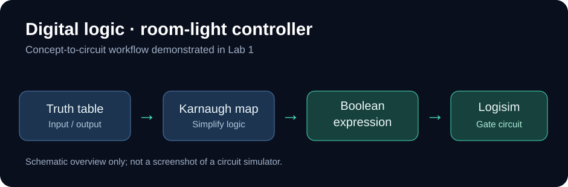

# Digital Logic — Boolean Circuits and Room-Light Control

**Computer Systems · Boolean Algebra · Karnaugh Maps · Logisim**

[← Academic portfolio](../ACADEMIC_PORTFOLIO.md)

This learning case study summarizes a Digital Logic lab in which Boolean expressions were represented as **truth tables**, simplified using **Karnaugh maps**, and implemented as logic-gate circuits in **Logisim**.

*The graphic above is an original workflow summary, not a Logisim screenshot or a substitute for the lab diagrams.*

## Skills demonstrated

- Building four-input truth tables from Boolean expressions.
- Using Karnaugh maps to identify simplified expressions.
- Translating simplified logic into **AND / OR / NOT** gate arrangements.
- Building an alternative **two-level NAND** implementation for a room-light control function.
- Using Logisim circuit outputs to demonstrate specific input combinations.

## Room-light controller

A particularly useful portion of the lab models a room-light output using combinations of binary inputs. It connects abstract Boolean simplification with a concrete control-system example.

The submitted lab includes both an AND/OR/NOT implementation and a two-level NAND implementation, illustrating how a logic function can be represented with different gate families.

## Portfolio evidence

Original Logisim circuit captures and Karnaugh map screenshots have been reviewed and prepared locally with student-number labels removed. They are **not embedded publicly** while course-sharing rules are being checked.

## What I learned

How to move between logical requirements, truth tables, simplified Boolean expressions and gate-level implementations. This is a **circuit simulation** exercise, not a claim that I built or tested physical electronic hardware.

*Coursework summary only; original assessed pages and answers are not published here.*