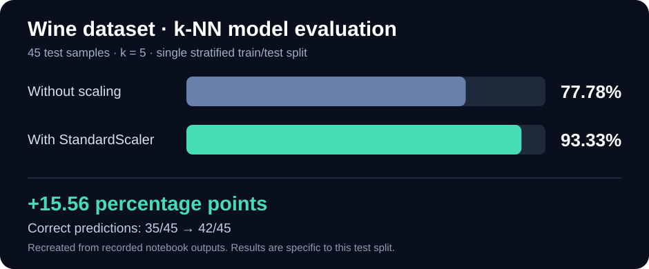

# Wine Dataset — Exploratory Analysis and k-NN Evaluation

**Applied AI & Machine Learning · Python · Pandas · scikit-learn · Matplotlib**

[← Academic portfolio](../ACADEMIC_PORTFOLIO.md)

This learning case study combines **two separate COIS 3550 activities** using the public Wine dataset included in scikit-learn: an exploratory-data assignment and a feature-scaling/model-evaluation lab. They use **different train/test splits** and should not be treated as one continuous experiment.

## 1. Data exploration and visualization

The dataset contains **178 observations**, **13 numeric features**, and **3 wine classes**.

- Inspected feature names, dataset shape and class labels.
- Examined feature values and descriptive statistics.
- Plotted **alcohol vs. color intensity** and **flavanoids vs. proline**, colouring points by class.
- Observed that flavanoids vs. proline appeared to separate the classes more clearly in the plotted data.
- Demonstrated an **80/20 train/test split**: **142 training** and **36 testing** observations.

**Note:** This exploratory assignment was not, by itself, a trained classifier. The model evaluation below is from a separate lab.

## 2. Feature scaling and model evaluation



A separate lab used a **75/25 stratified split** (random_state 123), producing **133 training** and **45 testing** samples, with **13 features**. A k-nearest neighbours classifier with `k = 5` was compared on raw and standardized inputs.

| Evaluation on the 45-item test set | Correct | Accuracy |
| --- | ---: | ---: |
| k-NN before feature scaling | 35 / 45 | **77.78%** |
| k-NN with `StandardScaler` | 42 / 45 | **93.33%** |

For this split, accuracy improved by **15.56 percentage points** following standardization. The scaler was fitted to the **training** features and then applied to the testing features, which avoids fitting scaling parameters on the test data.

### Confusion matrix after scaling

The notebook recorded:

```text
[[15  0  0]
 [ 2 15  1]
 [ 0  0 12]]
```

Rows represent the actual classes, columns the predicted classes. The diagonal totals **42 correct classifications**; the remaining **3** were errors involving actual class 1.

The lab also compared `k = 1, 3, 5, 7, 9`. For the reported split, **k = 5** had the best observed test accuracy of those choices.

## What I learned

- How to explore labelled numeric datasets before model development.
- Why differently scaled features can affect distance-based algorithms.
- How to use training/testing data to evaluate classifiers.
- Why accuracy and confusion matrices answer different questions.
- Why a result on **one specific test split** is not a guarantee of general performance.

## Evidence and reproducibility

The results above are based on the outputs captured in the coursework notebooks. The figure is a **new visualization of recorded results**, not a screenshot of the submitted notebook. Original scatter plots and confusion-matrix screenshots are retained in my private portfolio evidence collection pending course-sharing review.

A future independent demonstration can include a clean, reproducible notebook and documented dataset source, validation methods, and additional testing.

*Academic learning summary only; full assessed submissions are not published here.*